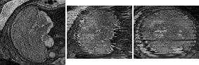
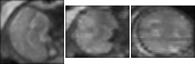

Mean filter with integral image (3D)
====================================

`python test.py`

Before filtering:        

After filtering:        

Acknowledgement
--------------

Code for integral images taken from:             
https://github.com/scikit-image/scikit-image
